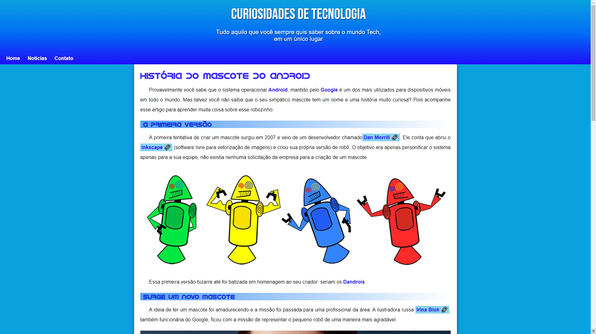

<h1 align="center">Site do Android</h1>

## Sobre o Projeto

Projeto de site responsivo com uma só página. Desenvolvido no final do módulo 2 do Curso de HTML5 e CSS3 da plataforma [Curso em Vídeo](https://www.cursoemvideo.com/) com o professor [Gustavo Guanabara](https://github.com/gustavoguanabara)

## Layout

</img>

## Tecnologias utilizadas

### Front-end (apenas)

</img>
 
</img>
 
</img>

## Pré-requisitos

* Navegador (ex: [Google Chrome](https://www.google.com/intl/pt-BR/chrome/))

## Desenvolvido em

22 de ago. de 2021

<strong>Novas features em Breve!<strong>

Made with 💙 by Rian Dias de Oliveira
